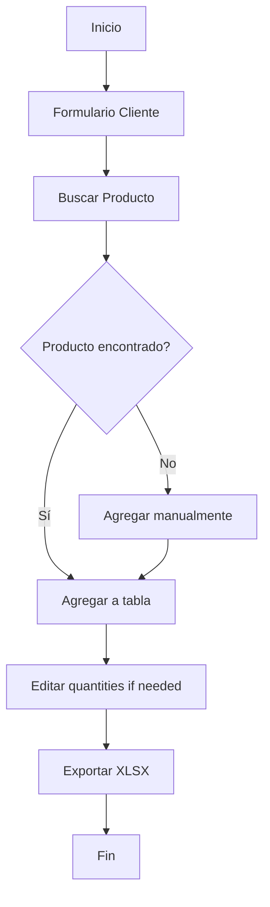

# Plan: Devolucion_de_Productos

## Descripción del Proyecto

Nuevo proyecto en **Astro** para gestionar devoluciones de productos, basado en el proyecto actual "hoja_de_pedido" pero con modificaciones específicas para el flujo de devoluciones.

---

## Estructura de Carpetas Propuesta

```
Devolucion_de_Productos/
├── public/
│   └── productos_local.json    (copia del original)
├── src/
│   ├── components/
│   │   ├── ClientForm.astro    (formulario de datos del cliente)
│   │   ├── ProductSearch.astro (buscador de productos)
│   │   ├── ProductTable.astro  (tabla de productos seleccionados)
│   │   └── ExportButton.astro  (botón exportar XLSX)
│   ├── layouts/
│   │   └── Layout.astro        (layout principal)
│   ├── pages/
│   │   └── index.astro         (página principal)
│   ├── scripts/
│   │   └── xlsxGenerator.js    (generador de Excel)
│   └── styles/
│       └── global.css          (estilos globales)
├── package.json
├── astro.config.mjs
└── tailwind.config.mjs
```

---

## Funcionalidades

### 1. Formulario de Cliente
- **Documento RUC/DNI**: Input numérico, 8 dígitos para DNI, 11 para RUC
- **Nombre del Cliente**: Input de texto
- **Código del Cliente**: Input de texto (nuevo campo)
- **Fecha**: Input de fecha (fecha actual por defecto)
- **Vendedor**: Input de texto

### 2. Buscador de Productos
- Campo de búsqueda por código o nombre
- Lista de resultados en tiempo real
- Opción de agregar manualmente productos no encontrados
- Copia del archivo `productos_local.json` como base de datos

### 3. Tabla de Productos Seleccionados
- Lista de productos agregados
- Campos editables:
  - CODIGO_ALMACEN (editable)
  - CODIGO_ARTICULO_EAN (opcional)
  - CODIGO_ARTICULO_CIPSA (código del producto, solo lectura)
  - CANTIDAD (editable)
  - PRECIO (solo lectura del catálogo)
  - MONEDA (vacío)
- Opción de eliminar productos
- Cálculo de totales

### 4. Exportación a Excel
Formato de columnas:
| CODIGO_ALMACEN | CODIGO_ARTICULO_EAN | CODIGO_ARTICULO_CIPSA | CANTIDAD | PRECIO | MONEDA |
|----------------|---------------------|----------------------|----------|--------|--------|
| (editable)     | (opcional)         | (código producto)   | (editar) | (catálogo) | (vacío) |

---

## Diagrama de Flujo



---

## Tecnologías a Utilizar

- **Framework**: Astro
- **Estilos**: Tailwind CSS
- **Excel**: xlsx (SheetJS)
- **Estado**: Nano Stores (para compartir estado entre componentes)

---

## Pasos de Implementación

1. **Crear proyecto Astro** con Tailwind
2. **Copiar** `productos_local.json` a la carpeta public
3. **Crear layout** base con Tailwind
4. **Crear componente ClientForm** con los 5 campos
5. **Crear componente ProductSearch** con búsqueda y opción manual
6. **Crear componente ProductTable** con productos seleccionados
7. **Crear xlsxGenerator** con el formato de devolución
8. **Integrar todo** en la página principal
9. **Probar** el flujo completo

---

## Notas

- El proyecto usará **Nano Stores** para manejar el estado global (cliente y productos seleccionados) ya que Astro es principalmente estático
- Se mantendrá la misma base de datos de productos (productos_local.json)
- El diseño será similar al proyecto actual "hoja_de_pedido" para mantener consistencia visual
